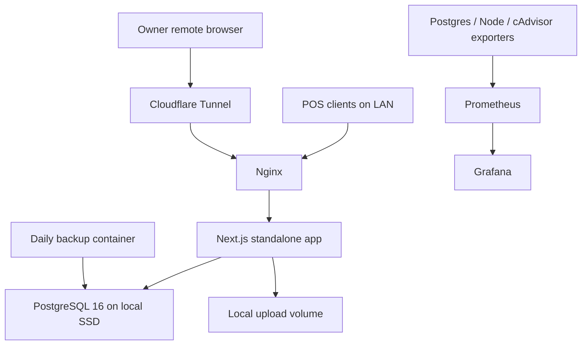

# Local POS

Self-hosted POS and stock management system for a single store LAN, designed to run on a Mini PC with Docker, PostgreSQL, Nginx, Cloudflare Tunnel, daily backups, and Grafana/Prometheus monitoring.

## Architecture



## First Deploy

1. Copy `.env.example` to `.env` and change every password/secret.

```powershell
Copy-Item .env.example .env
```

2. Choose where the local machine stores data.

For a simple install, keep the default relative paths:

```env
POSTGRES_DATA_DIR=./data/postgres
UPLOADS_DIR=./data/uploads
BACKUP_DIR=./backups/postgres
```

For production, point the database to the internal SSD and backups to another disk:

```env
POSTGRES_DATA_DIR=D:/pos-data/postgres
UPLOADS_DIR=D:/pos-data/uploads
BACKUP_DIR=E:/pos-backups/postgres
```

The machine running Docker owns these folders. If that machine is the Mini PC in the shop, the database and uploads live on the Mini PC.

3. Start the database and app stack.

```powershell
docker compose up -d postgres
docker compose build web
docker compose up -d
```

4. Run database migrations.

```powershell
docker compose run --rm web npm run db:migrate
```

5. Create the first owner account.

```powershell
docker compose run --rm web npm run db:create-admin
```

6. Open the app from LAN.

```text
http://<mini-pc-ip>/
```

Grafana is available at:

```text
http://<mini-pc-ip>/grafana/
```

## Daily Operations

Deploy update:

```powershell
git pull
docker compose build web
docker compose run --rm web npm run db:migrate
docker compose up -d
```

Create admin/reset owner password:

```powershell
docker compose run --rm web npm run db:create-admin
```

Check containers:

```powershell
docker compose ps
```

## Backup

The `backup` service runs daily and stores backups in:

```text
BACKUP_DIR
```

Choose the backup directory in `.env`:

```env
BACKUP_DIR=E:/pos-backups/postgres
```

Manual backup:

```powershell
.\scripts\backup\backup-postgres.ps1
```

Manual backup to a chosen folder:

```powershell
.\scripts\backup\backup-postgres.ps1 -OutputDir "E:/pos-backups/manual"
```

Restore from a selected backup file:

```powershell
.\scripts\restore\restore-postgres.ps1 -BackupFile "E:/pos-backups/postgres/pos_2026-06-15_22-00-00.dump"
```

Recommended production policy:

- Daily backups: 14 days
- Weekly backups: 8 weeks
- Monthly backups: 12 months
- Sync encrypted copies offsite with rclone

## Cloudflare Tunnel

Create a Cloudflare Tunnel and put the token in `.env`:

```text
CLOUDFLARE_TUNNEL_TOKEN=...
```

Route hostnames to:

```text
pos.example.com -> http://nginx:80
dashboard.example.com -> http://nginx:80/grafana/
```

Use Cloudflare Access for dashboard access, restricted to owner emails with MFA.

## Local Development

Install dependencies:

```powershell
npm install
```

Set `DATABASE_URL` and `AUTH_SECRET` in `.env`, then:

```powershell
npm run db:migrate
npm run db:create-admin
npm run dev
```

For phones or tablets on the same LAN, run the dev server on all network interfaces:

```powershell
npm run dev:lan
```

Show the LAN URL to open from another device:

```powershell
npm run lan:url
```

Open a small Windows control panel on the Mini PC:

```powershell
npm run panel
```

Or double-click:

```text
scripts/windows/open-control-panel.cmd
```

The control panel shows server status, LAN URLs, health check output, and the latest server logs. It also has buttons to start, stop, restart, open the web app, copy the LAN URL, and open the data/log folders.

Create a Desktop shortcut:

```powershell
.\scripts\windows\install-control-panel-shortcut.ps1
```

Open the control panel automatically after Windows login:

```powershell
.\scripts\windows\install-control-panel-shortcut.ps1 -Location Startup
```

If PostgreSQL is not running yet, development mode allows a temporary fallback owner login:

```text
Email: owner@example.com
Password: ChangeMe-Owner-Password-123!
```

This fallback is ignored in production because `NODE_ENV=production`.

Development mode also stores temporary product and stock data in:

```text
data/dev-store.json
```

Set `ALLOW_DEV_FILE_STORE=false` if you want local development to require PostgreSQL.

## Auto Start On Windows

For local development without Docker, install a Windows Scheduled Task:

```powershell
.\scripts\windows\install-dev-autostart.ps1
Start-ScheduledTask -TaskName "Local POS Dev Server"
```

If Windows denies permission for Scheduled Task, use a Startup folder shortcut instead:

```powershell
.\scripts\windows\install-startup-shortcut.ps1
```

The dev server will listen on all LAN interfaces:

```text
http://<computer-ip>:3000
```

Logs are written to:

```text
data/logs/auto-dev-server.log
```

Remove the dev auto-start task:

```powershell
.\scripts\windows\uninstall-dev-autostart.ps1
```

Remove the Startup folder shortcut:

```powershell
.\scripts\windows\uninstall-startup-shortcut.ps1
```

For production with Docker, install Docker Desktop, enable Docker Desktop startup with Windows, then run once:

```powershell
docker compose up -d
.\scripts\windows\install-docker-autostart.ps1
```

The compose services already use `restart: unless-stopped`, so they will keep coming back after container restarts.

## Migration From Supabase

1. Export Supabase public schema with `pg_dump`.
2. Map Supabase Auth users into `users`.
3. Move product images from Supabase Storage to `/data/uploads/products` or keep remote URLs temporarily.
4. Import products and stock tables into PostgreSQL.
5. Run validation counts for products, stock, users, and movements.
6. Freeze writes on the old system.
7. Import final delta and cut LAN clients over to the Mini PC URL.

See [docs/ARCHITECTURE.md](docs/ARCHITECTURE.md) for the full production notes.
